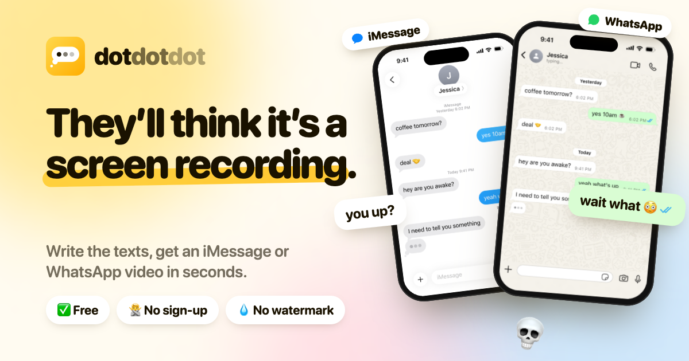
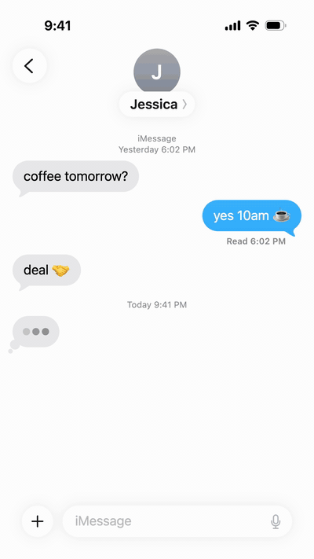
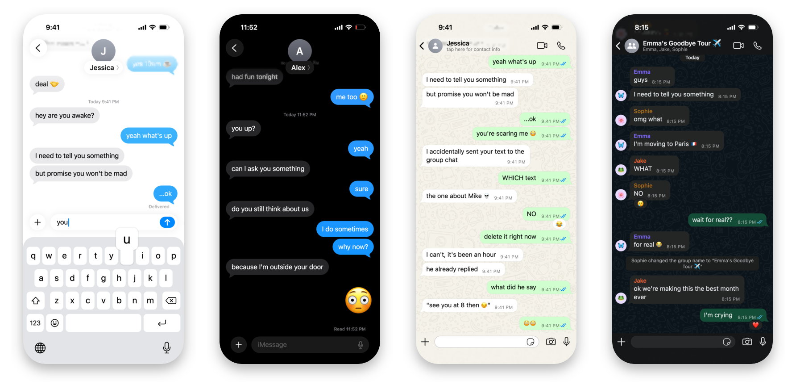
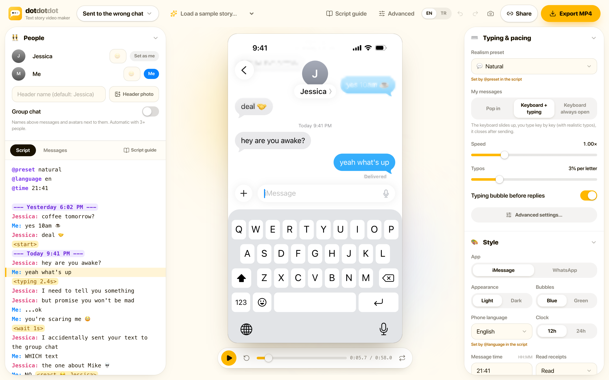
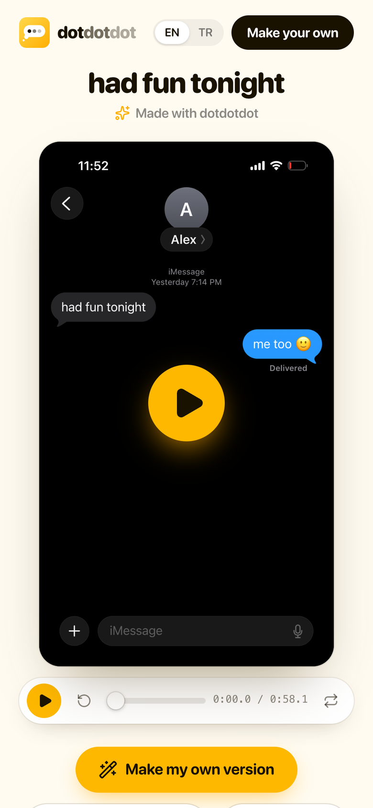

<p align="center">
  <a href="https://dotdotdot.batuhan.org"></a>
</p>

<p align="center">
  <b>Write a chat. Get a video that looks exactly like an iMessage or WhatsApp screen recording.</b><br />
  Rendered and exported right in your browser. Free, no sign-up, no watermark.
</p>

<p align="center">
  <a href="https://dotdotdot.batuhan.org"></a>
  <br />
  <a href="https://github.com/BatuhanK/dotdotdot/actions/workflows/ci.yml"></a>
  <a href="LICENSE"></a>
</p>

## What it does

You write the conversation as plain text. dotdotdot plays it back on a pixel-accurate iOS 26 Messages or WhatsApp
screen, with the timing of a real person: the keyboard slides up, keys are typed one by one (with typos that get
backspaced), the other side's typing bubble starts and stops, receipts turn to "Read". Then you download it as a
vertical MP4, ready for TikTok, Reels or Shorts.

<table>
  <tr>
    <td width="52%">

```
@preset natural
@time 21:41

--- Yesterday 6:02 PM ---
Jessica: coffee tomorrow?
Me: yes 10am ☕️
Jessica: deal 🤝
<start>
--- Today 9:41 PM ---
Jessica: hey are you awake?
Me: yeah what's up
<typing 2.4s>
Jessica: I need to tell you something
Jessica: but promise you won't be mad
Me: ...ok
Me: you're scaring me 😳
```

</td>
    <td width="48%" align="center">
      
    </td>
  </tr>
</table>

<p align="center">
  
</p>

## Features

- **iOS 26 Messages, pixel-matched**: header with avatar and name pill, bubbles with the screen-space blue/green
  gradient, iOS tails, big emoji, tapbacks, typing bubble, Delivered/Read receipts, scroll-edge blur, group chats with
  names and avatars, photo messages.
- **WhatsApp for iOS** (2025 look, `@app whatsapp`): doodle wallpaper, bubbles with tails, time and ticks, date chips,
  reactions, group names, avatars and group events, "typing…" in the header, WhatsApp's own sounds.
- **Human-like typing** on the iOS 26 keyboard: it slides up when "Me" types and closes after sending (or stays open), key
  previews, neighbour-key typos that get backspaced, typos noticed late, thinking pauses, changing your mind
  (`<mistake …>`, `<clear>`), messages typed but never sent.
- **The other side**: typing bubbles that stop and start again, fake typing that never arrives.
- **Realism presets** (Natural, Viral, Drama, Fast texter, Careful, Mom/Dad, No typing) and an advanced panel for every
  timing parameter. Everything is seeded, so the preview and the export are identical.
- **Looks**: light and dark, blue and green bubbles, 6 phone languages, 12/24h clock, 5 iPhones, full-screen, mockup or
  split layouts with image or video backgrounds, real iOS sounds, background music.
- **Export in the browser**: H.264 + AAC MP4 through WebCodecs and [Mediabunny](https://mediabunny.dev). Nothing is
  uploaded.
- **Projects** saved automatically in your browser (IndexedDB), with thumbnails, rename, duplicate and delete.
- **Share links** (`/s/:id`): anyone with the link can watch the story, download the MP4 or remix it. Links get a
  preview image in WhatsApp, X, iMessage… The creator can update or stop sharing at any time, without an account.
- **Write it with AI**: the in-app script guide includes a ready-made prompt for ChatGPT, Claude or Gemini.
- English and Turkish interface.

<p align="center">
  
</p>

## The script language

Plain text, one message per line, plus tags. Tags are forgiving (aliases, extra spaces), and unknown `<tags>` are shown
as text, so "I <3 you" is safe. The full reference lives in the app under **Script guide**; its source is
[`src/lib/script-docs.ts`](src/lib/script-docs.ts).

```
@preset drama            settings: theme, app, keyboard, typos, time, battery, title…
Alex: you up?            a message ("Me" is the phone's owner)
Me: I <mistake don't>do<pause 1.5s> sometimes      typing choreography
Me: why are you asking<clear>                      typed, deleted, never sent
<typing_stop Alex 2.5s>  they start typing… and stop
<typing 4s>              timing of the next message (also <wait>, <hold>, <instant>)
Alex: because I'm outside your door <react ❤️>
--- Today 9:41 PM ---    a timestamp
```

## Share links



Publishing a story gives a short link (`/s/<id>`). The page plays the story with the same
renderer, and offers the MP4 and a "Make my own version" button that copies the story, with its photos and music, into
the visitor's own projects.

There are no accounts: publishing returns a secret edit token that stays in the creator's browser and lets them update
the link or stop sharing. The server only keeps a SHA-256 of it. See [SECURITY.md](SECURITY.md) for how shared content
is checked and limited.

<br clear="right" />

## How it works

```
script ──parse──▶ messages ──compile──▶ timeline (when every bubble, keystroke and sound happens)
                                              │
                         draw(ctx, t) ◀───────┘   a pure function of time, Canvas 2D
                         │
        preview: requestAnimationFrame + Web Audio
        export:  frame i → canvas → VideoEncoder (H.264) ─┐
                 OfflineAudioContext mix → AAC ───────────┴▶ Mediabunny → MP4
```

The preview and the export use the same renderer, so the MP4 is exactly what you see. There is no server-side rendering:
the only backend is a small Cloudflare Worker that stores the stories people choose to share.

## Run it locally

You need Node 22.12+ and pnpm.

```bash
pnpm install
pnpm dev        # http://localhost:5199, the app and the Worker (local KV, R2 and Durable Objects)
```

| URL      |                                                                         |
| -------- | ----------------------------------------------------------------------- |
| `/`      | home page                                                               |
| `/app`   | editor (`/app?sample=group` opens an example, `/app?new=1` a new story) |
| `/s/:id` | a shared story                                                          |

Export needs WebCodecs: Chrome or Edge 94+, Safari 16.4+, Firefox 130+. When H.264 isn't available the exporter falls
back to VP9 or AV1.

## Deploy your own

The site is one Cloudflare Worker with static assets: the React app is served as files, and the Worker answers `/api/*`
and adds link-preview tags to `/`, `/app` and `/s/*`. KV stores shared projects, R2 their media, and a Durable Object
keeps daily per-IP budgets.

1. In [`wrangler.jsonc`](wrangler.jsonc), `env.production` is the official site. Change it to your account and domain,
   or delete `account_id`, `routes`, the KV `id` and the R2 `bucket_name`: Wrangler then deploys to `workers.dev` and
   creates the KV namespace and the R2 bucket on the first deploy.
2. Deploy:

   ```bash
   npx wrangler login
   pnpm run deploy
   ```

3. Optional: set an admin token to be able to take down any share:

   ```bash
   npx wrangler secret put ADMIN_TOKEN --env production
   curl -X DELETE https://your.domain/api/admin/shares/<id> -H "Authorization: Bearer <ADMIN_TOKEN>"
   ```

Limits are in [`wrangler.jsonc`](wrangler.jsonc) (per-minute rate limits; their `namespace_id` must be unique in your
account) and [`worker/limits.ts`](worker/limits.ts) (daily budgets: 300 new shares and 2 GB of uploads per IP).

### Share API

| Request                               | Does                                                            |
| ------------------------------------- | --------------------------------------------------------------- |
| `POST /api/shares`                    | publish `{ title, app, project, assets }` → `{ id, editToken }` |
| `GET /api/shares/:id`                 | the shared project and its media list                           |
| `PUT /api/shares/:id`                 | update (`Authorization: Bearer <editToken>`)                    |
| `DELETE /api/shares/:id`              | stop sharing (edit token)                                       |
| `PUT /api/shares/:id/assets/:assetId` | upload a media file listed in the share (edit token)            |
| `GET /api/shares/:id/assets/:assetId` | download a media file (`thumb` is the link-preview image)       |
| `DELETE /api/admin/shares/:id`        | take down a share (`ADMIN_TOKEN`)                               |

Errors are `{ error, code }` with a matching status; `code` is one of `invalid_request`, `not_found`, `unauthorized`,
`length_required`, `too_large`, `unsupported_media`, `rate_limited`, `quota_exceeded`, `server_error`.

Per share: a project of up to 320 KB, 40 media files, photos up to 8 MB, sounds 25 MB, videos 90 MB, 160 MB in total.
Formats: JPG, PNG, WebP, GIF, AVIF, HEIC, MP4, MOV, WebM, MP3, M4A, AAC, WAV, OGG, FLAC (no SVG). Projects are JSON in KV
(`share:<id>`), media are R2 objects (`s/<id>/<assetId>`).

## Project structure

| Path                                              |                                                                                                    |
| ------------------------------------------------- | -------------------------------------------------------------------------------------------------- |
| `src/lib/script.ts`                               | script parser and editing helpers                                                                  |
| `src/lib/script-docs.ts`                          | script language reference and the AI prompt                                                        |
| `src/lib/presets.ts`                              | realism presets, `@settings` → project                                                             |
| `src/lib/timeline.ts`                             | timing model: human-like typing, typos, keyboard, receipts, sounds                                 |
| `src/lib/project-schema.ts`                       | validation of saved and shared projects (used by the app and the Worker)                           |
| `src/render/imessage.ts`, `whatsapp.ts`           | the two chat screens                                                                               |
| `src/render/keyboard.ts`                          | the iOS 26 keyboard                                                                                |
| `src/render/compose.ts`                           | full-screen, mockup and split layouts, device frames                                               |
| `src/render/text.ts`, `fonts.ts`, `emoji.ts`      | text layout with SF Pro tracking, Apple emoji                                                      |
| `src/lib/export.ts`, `audio.ts`                   | WebCodecs + Mediabunny export, sound mix                                                           |
| `src/lib/projects.ts`, `share.ts`, `snapshots.ts` | local projects, share links, thumbnails and link-preview images                                    |
| `src/landing/`, `src/share/`                      | home page (its phones use the real renderer) and the shared story page                             |
| `src/lib/ui-i18n.ts`, `i18n.ts`                   | interface strings (EN/TR) and the strings drawn on the phone                                       |
| `worker/`                                         | Cloudflare Worker: share API and media (`shares.ts`), pages and link previews (`pages.ts`), limits |
| `src/dev/fidelity.ts`                             | dev tools that render frames for pixel comparison with iOS screenshots                             |

## Contributing

Issues and pull requests are welcome. See [CONTRIBUTING.md](CONTRIBUTING.md) for the setup, the checks and where to
change what. Report security problems privately, as described in [SECURITY.md](SECURITY.md).

## Third-party assets and trademarks

dotdotdot is not affiliated with, endorsed by or sponsored by Apple Inc. or WhatsApp LLC / Meta Platforms, Inc.
iMessage, iPhone and SF Pro are trademarks of Apple Inc.; WhatsApp is a trademark of WhatsApp LLC.

So that the videos match the real apps, this repository includes files that belong to their owners and are **not**
covered by the MIT license:

- `public/fonts`: SF Pro Text, Display and Rounded (Apple), subset to Latin, Greek and Cyrillic.
- `public/emoji`: Apple Color Emoji glyphs (160 px WebP), used where the browser can't draw Apple emoji natively.
  `?emoji=img` forces them on Apple devices too.
- `public/sounds`: iOS message, tapback and keyboard sounds (Apple), and WhatsApp's in-chat send/receive sounds
  (WhatsApp for Mac).
- `public/wa`: WhatsApp's default chat wallpaper.

You are responsible for how you use them. If you own any of these and want them removed, open an issue.

## License

The source code is [MIT](LICENSE) licensed. The third-party assets listed above are not.
